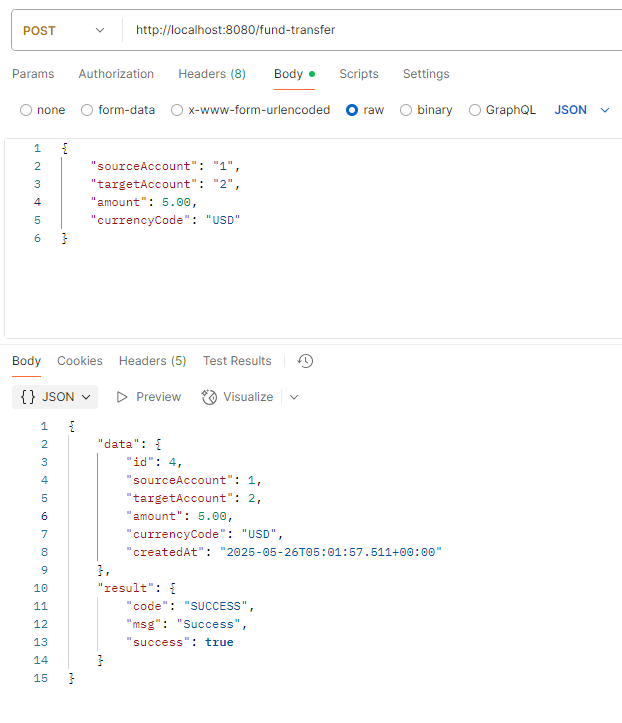

# Fund Transfer Demo

## Solves concurrency issue of updating specific rows in database via ordered pessimistic locking with retry mechanism

## Technologies
- Java 21
- Spring Boot 3.5.0
- Spring Data JPA
- Spring Retry 2.0.12
- Lombok 1.18.30
- Mockito
- Maven
- H2 Database

---

# Setup
> **NOTE: Proceed with Application Start if no changes are made**
## Database 
### Tables and Data
- Enable jpa validate in application.properties ```spring.jpa.hibernate.ddl-auto=validate```
- Create table if not exists script in schema.sql
- Fixed data for Account table. Insert script in data.sql

### H2 Console
- Enable console in application.properties
  ```spring.h2.console.enabled=true```
- Navigate on browser and use port set in application.properties -> server.port ```http://localhost:<port>/h2-console```
- Use default username (sa); password=*see application properties -> spring.datasource.password*

### Data Cleanup
- Enable jpa drop in application.properties ```spring.jpa.hibernate.ddl-auto=drop```
- Start/Rerun Application

## Start Application
- First, clone project ```git clone https://github.com/tansantosiii/fund-transfer-demo.git```
- Default port is set to 8080 (Change in ```application.properties``` if needed)
- Open or navigate to project folder
- Execute ```mvn clean install``` to download dependencies
- Execute ```mvn spring-boot:run``` to run the application

## Unit Test 
- Execute ```mvn test```

---

# Sample HTTP request for /fund-transfer
```bash 
curl --location 'http://localhost:8080/fund-transfer' \
--header 'Content-Type: application/json' \
--data '{
    "sourceAccount": "1",
    "targetAccount": "2",
    "amount": 5.00,
    "currencyCode": "USD"
}' 
```

